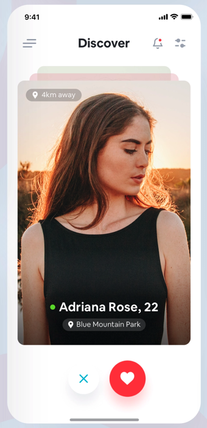
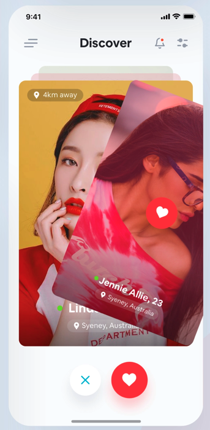
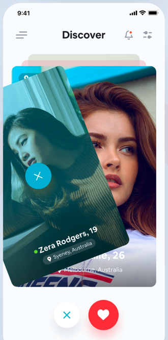

## Final Test

### Goal

Write a "simple" single-page application which looks and acts like a famous dating app.

#### App look

app home | like animation | skip animation
--- | --- | ---
 |  | 

#### Requirements

Applications home screen contains an endless carousel (or a deck) of cards, each card represents some info about a random person from an API, on a visible card the next info is displayed:

- Full name
- Age
- City
- Distance

Below the carousel there are buttons for `like` and `skip` actions, you can also swipe right for the `like` action and swipe left for the `skip` action.

- `like` action switches to the next card in a deck with a *like* animation
- `skip` action switches to the next card in a deck with a *skip* animation

- Use UIKit or SwiftUI
- For the API use [RandomAPI](https://randomuser.me/) paginated request
- You can use any 3rd party framework or service (Swift Package Manager is preferred)

[//]: [Design](https://dribbble.com/shots/7109564-Dating-Application)